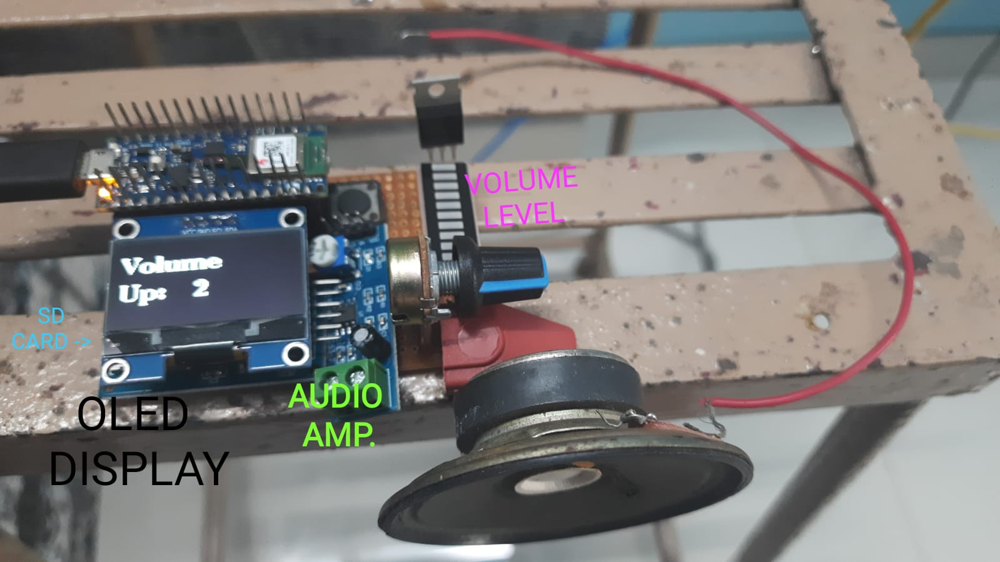
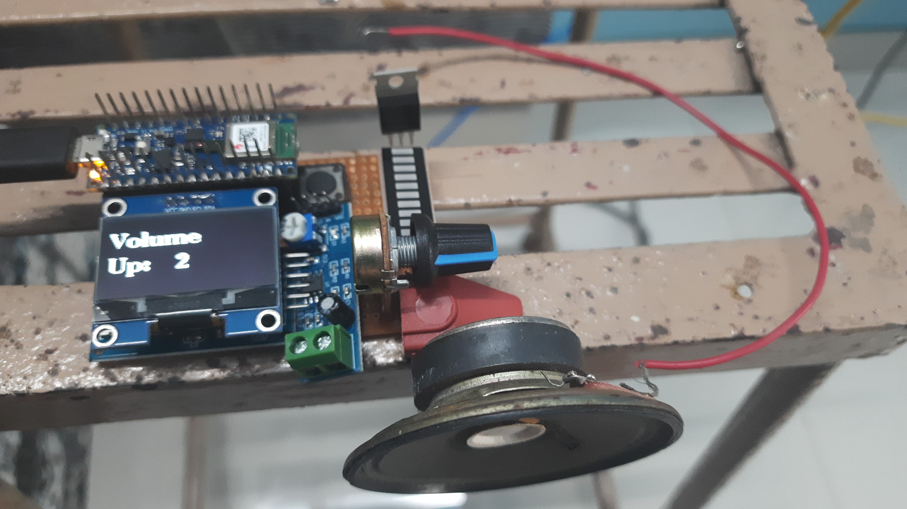

# SmartDuino

## Introduction

This is an Open Source Project that aims to provide a Smart Speaker with an extremely intuitive user interface using gestures and OLED Display.
It flaunts amazing features like:
- OLED Module for high contrast and low power consumption Display Interface.
- Air Gestures to control music playback and volume (No more BUTTONS!)
- Air Humidity and Temperature Sensing.
- Timer with alarm.
- Fun Games using motion detection.
- BLE for low power wireless connectivity with your smartphone.

## Preview

### About: Arduino Nano 33 BLE Sense

The pin diagram is

Features:

1. **Vin:** This pin can be used to power the board with a DC voltage source. If the power is fed through this pin, the USB power source is disconnected. This pin is an INPUT. Respect the voltage limits to assure the proper functionality of the board

2. **5V:** This pin outputs 5V from the board when powered from the USB connector or from the VIN pin of the board.

_Note:_ for it to work, you need to short the VBUS jumper on the back of the board.

3. **3.3V:** This pin outputs 3.3V through the on-board voltage regulator. _Note:_ for ultra low-power functionality, you should cut the 3V3 jumper on the back of the board, and use an external battery at 3V3.
LED ON: This LED is connected to the 5V input from either USB or VIN.

## Hardware Requirements

1. Arduino nano ble sense
2. SD Card Module
3. Speaker
4. Audio Amplifier

## Project Milestones

- [X] Provide Air gestures for Music Volume and Playback control
- [ ] IMU for mode toggle:
	- [X] Gyroscope selection of different modes (Left flick and right flick)
	- [ ] Use Accel. for skip/back 5 seconds in music (move up/ down)
- [ ] Interface SD card with MCU
- [ ] Interface audio amplifier with DAC of MCU
- [ ] Play music from SD Card

## PCB Design

## Precautions

1. Use a good quality USB type B micro Cable to power the Arduino NANO BLE. Otherwise you may face glitchy OLED text or arduino hangs.
2. Double check the I2C, GPIO and other pins before soldering.

## References:

1. [simple audio player](https://www.arduino.cc/en/Tutorial/SimpleAudioPlayer)
2. [DS-15580-Arduino_Nano_33_BLE_Sense.pdf](https://cdn.sparkfun.com/assets/0/d/8/4/9/DS-15580-Arduino_Nano_33_BLE_Sense.pdf)
3. [arduino-nano-33-ble](https://store.arduino.cc/products/arduino-nano-33-ble)
4. [Datasheet](https://docs.arduino.cc/static/302aa1d360c877c9bbab39f14e2f3ea6/ABX00031-datasheet.pdf)
5. [Useful libraries for accessing on-board sensors](https://www.arduino.cc/en/Guide/NANO33BLESense)
